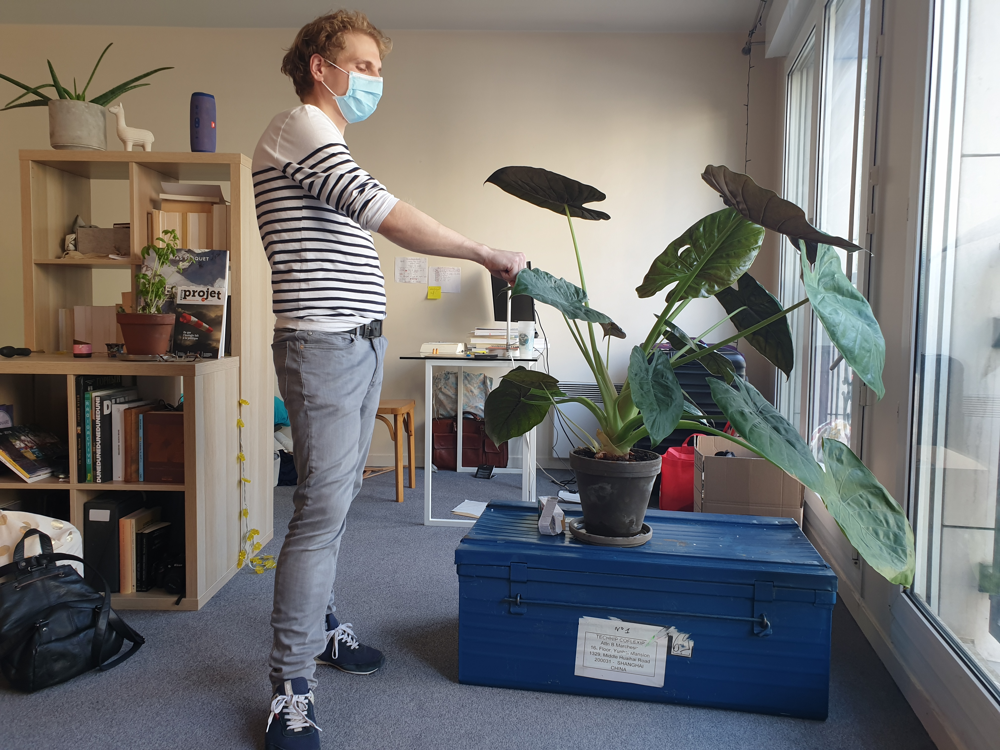
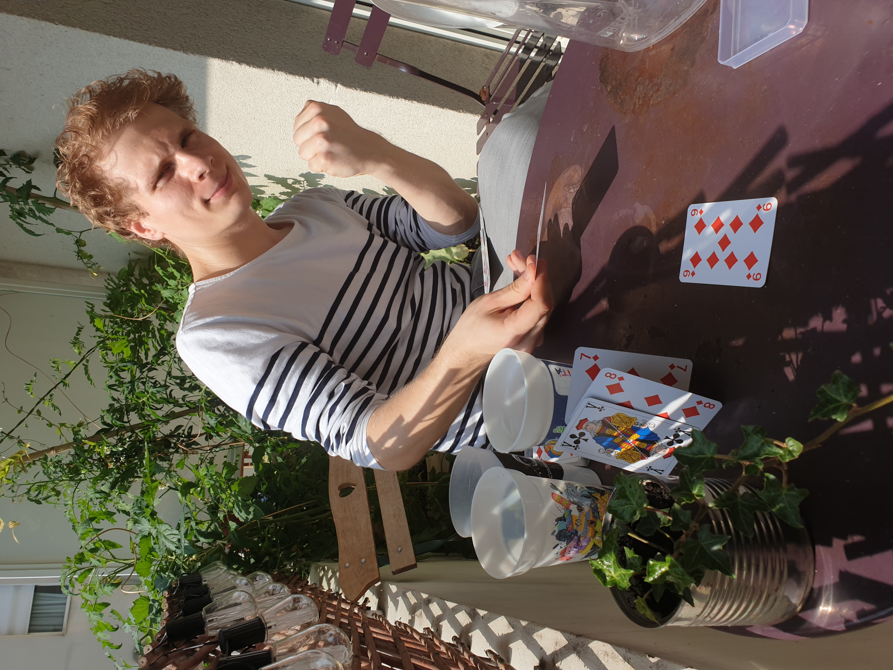
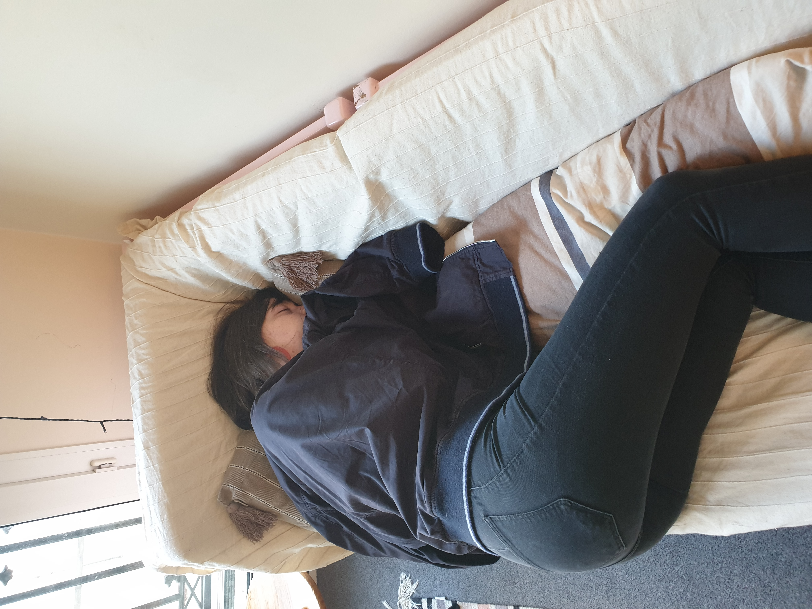

Samedi dernier a eu lieu la recontre tant attendue entre plantes et plant-sitter... et tout s'est passé à merveille ! 

<!-- end -->

## Présentations

Le stress et l'excitation montent ! C'est l'heure de la rencontre de nos plantes adorées. Bien entendu le protocole sanitaire a été respecté à la lettre, avec port du masque et lavage de main régulier obligatoire. 

## Premières activités

Une fois les présentations faites et les plantes rassasiées, les premiers jeux et activités ont pris place. Au planning : jeux de cartes et time's up ! 

Thomas, le plant de tomate cerise témoigne : *"C'est trop cool cette colo, Matthieu est vraiment super sympa ! Il nous a fait découvrir plein de jeux auxquels Gaïa ne voulait pas qu'on joue, on adore!"* 

C'est de bonne augure pour la suite de ces vacances!

## Repos bien mérité

Une fois leur mission accomplie, les plant-sitters ont mérité à leur tour un peu de répit. Clara, responsable du pôle *aloe vera*, profite ainsi d'une sieste tactique, la tête pleine de rêves de salades tomates-mozza-basilic.
 